# BÁO CÁO KIỂM TOÁN TÁI CẤU TRÚC HỆ THỐNG
## (AI REHABILITATION & SAFETY ASSISTANT — PHASE 0 AUDIT REPORT)

**Tác giả:** Senior Software Architect & AI Engineer  
**Ngày thực hiện:** 30/09/2026  
**Phiên bản dự án:** Final Science Competition MVP  
**Tài liệu tham chiếu:** Master Prompt — AI Rehabilitation & Safety Assistant Restructure  

---

## 1. MỤC TIÊU & PHẠM VI SẢN PHẨM CUỐI CÙNG (FINAL PRODUCT SCOPE)

Dự án chuyển đổi thành **AI REHABILITATION & SAFETY ASSISTANT** (Trợ lý Phục hồi Chức năng & Giám sát An toàn Thông minh).
Phạm vi hệ thống được cố định nghiêm ngặt vào đúng **4 module AI duy nhất**:

1. **Face Recognition (Nhận diện khuôn mặt):** Định danh cá nhân hóa người cao tuổi, truy xuất hồ sơ và email người chăm sóc.
2. **Emotion Recognition (Nhận diện cảm xúc):** Giám sát trạng thái tinh thần (Vui vẻ, Bình thường, Buồn bã) với bộ làm mượt thời gian.
3. **Rehabilitation (Phục hồi chức năng):** Trọng tâm nghiên cứu học thuật về phân tích động học tư thế (MediaPipe Pose, FSM cho 3 bài tập, đếm nhịp, chấm điểm form).
4. **Fall Detection (Phát hiện té ngã):** Phát hiện nguy cơ té ngã theo thời gian thực, xác minh đa tầng qua máy trạng thái thời gian (Temporal Verification FSM), lưu trữ bằng chứng hình ảnh (snapshot/video) và gửi cảnh báo Gmail tới người chăm sóc.

### ⚠️ Các thành phần LOẠI BỎ KHỎI RUNTIME:
- **Voice Interaction & Feedback:** Loại bỏ hoàn toàn khỏi runtime (startup, router, UI, state, tests). Chuyển mã nguồn lưu trữ vào `archive/voice/` để tham khảo khi cần.
- **Không tái giới thiệu:** Gesture, Medication, Memory, Object Location, LLM Chatbot, Wearables, Cloud Backend, Microservices, Event Buses.

---

## 2. HIỆN TRẠNG 3 MODULE ỔN ĐỊNH (DO NOT REWRITE)

Ba module sau đây đã được kiểm thử, tối ưu và hoạt động ổn định — **TUYỆT ĐỐI KHÔNG VIẾT LẠI MÔ HÌNH VÀ THUẬT TOÁN**:

| Module | Adapter & File chính | Thuật toán / Mô hình cốt lõi | Hiện trạng kiểm thử | Cam kết duy trì |
|---|---|---|---|---|
| **Face Recognition** | `adapters/face_adapter.py` | OpenCV DNN SSD 300x300 + LBPH ($200 \times 200$, CLAHE, Bilateral, 15% padding, $\text{THRESHOLD}=58.0$) | Nhận diện thành công `gokigenzo` ($d=47.38$, conf $75.1\%$), từ chối người lạ ($d=61.55 \ge 58.0$) | **GIỮ NGUYÊN 100%**. Chỉ tích hợp `user_id` để kết nối hồ sơ người chăm sóc. |
| **Emotion Recognition** | `adapters/emotion_adapter.py` | MediaPipe FaceMesh (468 landmarks) + FACS Action Units (AU12/15) + ExpressionNet PyTorch + Deque Smoothing ($N=8$) | Nhận diện 3 trạng thái: Bình thường, Vui vẻ, Buồn bã. Triệt tiêu 78.6% rung giật frame. | **GIỮ NGUYÊN 100%**. |
| **Rehabilitation** | `adapters/rehabilitation_adapter.py` `modules/rehabilitation/rehab_engine.py` | MediaPipe Pose 33 landmarks + FSM State Machines (Arm Raise, Sit-to-Stand, Marching) + Form Biomechanics | Đếm nhịp chuẩn, trừ điểm lỗi form (thẳng tay, gối, đối xứng), tính điểm $0-100\%$. | **GIỮ NGUYÊN 100%**. Thay thế callback giọng nói bằng UI Text Feedback. |

---

## 3. KIỂM TOÁN CHI TIẾT CÁC THÀNH PHẦN HIỆN TẠI

### 3.1. Thành phần Voice (Cần loại bỏ khỏi Runtime)

- **Phụ thuộc gói thư viện (`requirements.txt`):**
  - `vosk>=0.3.45`
  - `pyttsx3>=2.90`
  - `sounddevice>=0.4.6`
  *Kế hoạch:* Đưa vào nhóm phụ thuộc tùy chọn hoặc gỡ bỏ khỏi `requirements.txt` tối giản runtime.
- **Mã nguồn module:**
  - `modules/voice/` (Gồm mô hình âm thanh Vosk `model_vi`, `intents.py`, regex khẩu lệnh tiếng Việt, TTS wrapper).
  *Kế hoạch:* Lưu giữ trong `archive/voice/`, ngắt hoàn toàn kết nối với runtime app.
- **Adapter Voice (`adapters/voice_adapter.py`):**
  - Khởi tạo engine `pyttsx3` và luồng chạy nền phân loại khẩu lệnh.
  *Kế hoạch:* Chuyển vào `archive/`, thay thế bằng logic tĩnh hoặc loại bỏ khỏi `adapters/__init__.py`.
- **Giao diện người dùng (`app/dashboard.py`):**
  - Khung Card 3 cột phải: `card_voice` (gồm 5 nút khẩu lệnh nhanh, `edit_voice` QLineEdit, nút "Gửi", `lbl_assistant_speech`).
  - Timer cập nhật văn bản trợ lý giọng nói: `voice_res = self.router.voice_adapter.get_result()`.
  *Kế hoạch:* Thay thế toàn bộ Card này bằng **Panel Giám Sát An Toàn & Té Ngã (Safety Monitoring / Fall Detection)**.
- **Tín hiệu & Bộ định tuyến (`app/router.py`):**
  - Khởi tạo `self.voice_adapter = VoiceAdapter(...)`.
  - Callback `handle_voice_intent()`, `execute_voice_command()`, `voice_feedback_fn=self.voice_adapter.speak`.
  *Kế hoạch:* Loại bỏ các lời gọi `self.voice_adapter.speak()`, thay bằng cập nhật text thông báo giao diện và trạng thái hệ thống.
- **Trạng thái dùng chung (`app/state.py`, `services/state_service.py`):**
  - Trường `last_voice_command`.
  *Kế hoạch:* Loại bỏ `last_voice_command`, bổ sung các trường giám sát an toàn: `fall_state`, `fall_confidence`, `last_fall_event`, `caregiver_email`, `email_status`.
- **Bài kiểm thử (`tests/test_rehab_assistant.py`):**
  - Lớp `TestVoiceAdapterAndIntents` và các test case `test_voice_*`.
  *Kế hoạch:* Tách và chuyển đổi test case Voice sang bộ test Fall Detection & Email Alert mới.

### 3.2. Giao diện Nhận diện Khuôn mặt (Face Interface)
- **Tệp nguồn:** `adapters/face_adapter.py`
- **Phương thức khả dụng:**
  - `detect_face(frame) -> (x, y, w, h, conf)`
  - `extract_face_roi(frame, box, padding_ratio=0.15, target_size=(200, 200)) -> np.ndarray`
  - `crop_face(frame, box, padding_ratio=0.15) -> np.ndarray`
  - `recognize_face(frame) -> Dict[str, Any]` (trả về `status`: "recognized"/"unknown", `patient_id`, `name`, `confidence`, `distance`)
  - `draw_tracking_overlay(frame) -> frame` (vẽ bounding box xanh lục hoặc cam cảnh báo)
  - `register_patient(...)`, `get_patient_profile(patient_id)`, `get_all_patients_dict()`, `delete_patient(patient_id)`.
- **Đánh giá:** Giao diện rất rõ ràng, chuẩn hóa tốt, trả về `patient_id` (được ánh xạ thành `user_id`). Cần tích hợp thêm trường thông tin `caregiver` vào cấu trúc hồ sơ trả về.

### 3.3. Giao diện Cảm xúc (Emotion Interface)
- **Tệp nguồn:** `adapters/emotion_adapter.py`
- **Phương thức khả dụng:**
  - `process_frame(frame) -> (frame, emotion_dict)`
  - `get_smoothed_emotion() -> (emotion_vi, confidence)`
  - `draw_overlay(frame, face_box)`
  - `get_result() -> dict`
- **Đánh giá:** Module chạy in-memory ổn định, độc lập, không phụ thuộc ngoài.

### 3.4. Giao diện Phục hồi Chức năng (Rehabilitation Interface)
- **Tệp nguồn:** `adapters/rehabilitation_adapter.py` & `modules/rehabilitation/rehab_engine.py`
- **Phương thức khả dụng:**
  - `select_exercise(name)`
  - `process_frame(frame) -> (frame, metrics)`
  - `finish_exercise() -> summary_dict`
  - `get_result() -> dict`
- **Đánh giá:** Đã có đầy đủ 3 bài tập y khoa. Độc lập với camera qua hàm `process_frame`.

### 3.5. Hiện trạng Module Fall & Hạ Tầng Cần Xây Dựng Mới
- **Hiện trạng:** Thư mục `modules/fall` trước đó đã bị xóa khi dọn dẹp hệ thống v1.0.
- **Yêu cầu theo Master Prompt:**
  1. Xây dựng động cơ nhận diện té ngã chuẩn xác:
     - Dựa trên động học tư thế (Pose Kinematics) từ MediaPipe Pose (đã có sẵn trong môi trường, chạy cực nhanh 30+ FPS).
     - Phân tích:
       * Tỷ lệ khung bao quanh thân thể (Aspect Ratio: chiều rộng / chiều cao thân $W/H > 1.25$ khi nằm ngã so với $W/H < 0.8$ khi đứng).
       * Góc nghiêng thân người (Torso Inclination Angle đo từ trục thẳng đứng: $> 55^\circ$).
       * Độ cao trọng tâm (Center of Mass / Hip Keypoints) sụt giảm đột ngột và duy trì ở sát mặt sàn.
       * Vận tốc rơi thẳng đứng ($\Delta Y / \Delta t$).
  2. **Máy trạng thái xác minh theo thời gian (Temporal Verification FSM):**
     $$\text{NORMAL} \longrightarrow \text{SUSPECTED} \longrightarrow \text{CONFIRMING} \longrightarrow \text{FALL\_CONFIRMED} \longrightarrow \text{COOLDOWN} \longrightarrow \text{NORMAL}$$
     - Ngưỡng thời gian cấu hình được (`FALL_CONFIRM_SECONDS = 3.0s`, `FALL_COOLDOWN_SECONDS = 30.0s`).
     - Tự động trở về `NORMAL` nếu người dùng tự đứng dậy trong thời gian xác nhận (tránh báo động giả khi cúi nhặt đồ, ngồi xuống ghế, hoặc nằm nghỉ chủ động).
  3. **Lưu trữ bằng chứng sự kiện (`data/fall_events/`):**
     - Lưu thư mục dạng: `data/fall_events/fall_YYYYMMDD_HHMMSS/`
       * `event.json` (thông tin sự kiện, người dùng, thời gian, độ tin cậy, trạng thái email).
       * `snapshot.jpg` (ảnh chụp khoảnh khắc ngã kèm khung xương nhận diện).
  4. **Adapter:** `adapters/fall_adapter.py`.
  5. **Dịch vụ giám sát an toàn:** `services/fall_monitor.py`.

### 3.6. Dịch vụ Email (Email Service)
- **Hiện trạng:** Chưa có dịch vụ Email trong mã nguồn hiện tại.
- **Yêu cầu theo Master Prompt:**
  - Xây dựng `services/email_service.py` gửi cảnh báo khẩn cấp từ Gmail hệ thống qua giao thức SMTP (`smtp.gmail.com:587`, STARTTLS).
  - Cấu hình an toàn qua `.env` (`EMAIL_ENABLED`, `EMAIL_HOST`, `EMAIL_PORT`, `EMAIL_USERNAME`, `EMAIL_PASSWORD`). Không hardcode mật khẩu, không lưu mật khẩu người dùng vào JSON.
  - Người nhận: `caregiver.email` truy xuất từ hồ sơ của `user_id` vừa được nhận diện.
  - Cơ chế phòng ngừa lỗi: Nếu gửi mail thất bại (mất mạng, sai thông tin SMTP), **KHÔNG ĐƯỢC CRASH ỨNG DỤNG**, ghi log lỗi, đánh dấu `email_status = "failed"` và hiển thị trạng thái lên UI.
  - Cơ chế chống gửi trùng lặp (Anti-spam / Duplicate prevention): Một sự kiện ngã chỉ gửi đúng 1 email cảnh báo; trạng thái `COOLDOWN` ngăn việc gửi liên tục.

### 3.7. Quản lý Camera (`CameraManager`)
- **Tệp nguồn:** `core/camera_manager.py` (cần tạo cầu nối/module tại `app/camera_manager.py` theo kiến trúc đích).
- **Cơ chế phân quyền Camera duy nhất (Single Camera Pipeline):**
  - **Chế độ Giám sát (MONITORING MODE):** Khung hình được chia sẻ đồng thời cho `FaceAdapter`, `EmotionAdapter` và `FallAdapter`.
  - **Chế độ Phục hồi (REHABILITATION MODE):** Khung hình tập trung toàn bộ cho `RehabilitationAdapter`.
  - Không bao giờ để 2 tiến trình cùng mở `cv2.VideoCapture(0)`. Có sẵn cơ chế tự động mô phỏng (Simulation Fallback) khi không có webcam vật lý.

### 3.8. Đăng ký Người dùng & Hồ sơ Người chăm sóc (User & Caregiver Registration)
- **Tệp nguồn:** `app/registration_dialog.py`
- **Cần mở rộng:**
  - Thêm các ô nhập thông tin Người chăm sóc (Caregiver):
    * Họ tên người chăm sóc (`caregiver_name`)
    * Mối quan hệ (`caregiver_relation`: Con, Vợ/Chồng, Cháu, Điều dưỡng, v.v.)
    * Gmail người nhận cảnh báo (`caregiver_email`) kèm hàm kiểm tra định dạng email hợp lệ (Regex).
  - Cấu trúc lưu trữ chuẩn hóa tại `data/users/{user_id}.json` và `data/users/users.json` (đồng thời giữ tương thích ngược với `shared/data/patients.json` để không làm mất 6 ảnh mẫu khuôn mặt của `gokigenzo` ID `1`).
  - Xây dựng `services/user_service.py` đóng gói toàn bộ logic truy vấn hồ sơ, lấy email người chăm sóc dựa trên `user_id`.

### 3.9. Kiểm tra Nhật ký Hoạt động (`logs/app.log`)
- Lịch sử log lúc 14:35 - 14:38 cho thấy hệ thống hoạt động rất mượt mà:
  - `FaceAdapter` nhận diện khuôn mặt người dùng chính xác.
  - `EmotionAdapter` nạp ExpressionNet và MediaPipe FaceMesh trơn tru.
  - `RehabEngine` nạp MediaPipe Pose, thực hiện bài tập Nâng tay qua đầu (Arm Raise) và hoàn thành chấm điểm.
  - Camera vật lý mở và đóng đúng chuẩn.
  - Không phát hiện bất kỳ lỗi sập hệ thống (Crash/Segfault) nào trong 3 module nền tảng.

---

## 4. KẾ HOẠCH TRIỂN KHAI THEO TỪNG PHA (IMPLEMENTATION ROADMAP)

```mermaid
flowchart TD
    P0["<b>PHASE 0: Audit</b><br/>docs/RESTRUCTURE_AUDIT.md<br/><i>(Đã hoàn thành)</i>"]
    P1["<b>PHASE 1: Gỡ Voice khỏi Runtime</b><br/>Lưu trữ code vào archive/voice/<br/>Gỡ Voice khỏi dashboard, router, state, tests<br/>Kiểm tra Face + Emotion + Rehab"]
    P2["<b>PHASE 2: Mở rộng Hồ sơ User & Caregiver</b><br/>Thêm thông tin Caregiver + Gmail Validation<br/>Xây dựng services/user_service.py"]
    P3["<b>PHASE 3 & 4: Fall Detection & Temporal FSM</b><br/>Động cơ tư thế & ngã Pose Kinematics<br/>FSM: NORMAL -> SUSPECTED -> CONFIRMING -> FALL_CONFIRMED -> COOLDOWN<br/>Lọc báo động giả (ngồi, cúi, nhặt đồ)"]
    P5["<b>PHASE 5: Lưu trữ Bằng chứng Sự kiện Ngã</b><br/>Tạo data/fall_events/fall_timestamp/<br/>Lưu event.json + snapshot.jpg"]
    P6["<b>PHASE 6: Dịch vụ Gửi Cảnh Báo Gmail</b><br/>services/email_service.py<br/>SMTP an toàn, đính kèm ảnh, chống spam, không crash khi mất mạng"]
    P7["<b>PHASE 7: Chuỗi Luồng Tích Hợp Xuyên Suốt</b><br/>Face -> user_id -> caregiver.email -> Fall Alert"]
    P8["<b>PHASE 8: Tích hợp Camera Pipeline</b><br/>Monitor Mode: Face + Emotion + Fall<br/>Rehab Mode: Rehabilitation"]
    P9["<b>PHASE 9: Cập nhật Dashboard UI</b><br/>Thay thế Card Voice bằng Panel Giám sát An toàn & Ngã"]
    P10["<b>PHASE 10: Kiểm thử Toàn diện End-to-End</b><br/>Test kịch bản 30 bước, nghiệm thu chất lượng"]
    P11["<b>PHASE 11: Đánh giá Khoa học & Tài liệu</b><br/>docs/EXPERIMENT_PLAN.md"]

    P0 --> P1 --> P2 --> P3 --> P5 --> P6 --> P7 --> P8 --> P9 --> P10 --> P11
```

### Chi tiết các tệp sẽ tạo mới hoặc thay đổi:

1. **Thư mục & Tệp tạo mới:**
   - `archive/voice/` (Lưu trữ toàn bộ code Voice cũ).
   - `modules/fall/fall_detector.py` (Động cơ tính toán động học tư thế & nhận diện ngã).
   - `adapters/fall_adapter.py` (Adapter chuẩn hóa kết nối với CameraManager và FSM).
   - `services/fall_monitor.py` (Máy trạng thái thời gian Temporal FSM, lưu snapshot bằng chứng).
   - `services/email_service.py` (Dịch vụ gửi Gmail cảnh báo khẩn cấp an toàn).
   - `services/user_service.py` (Quản lý hồ sơ Người dùng + Người chăm sóc).
   - `data/users/`, `data/fall_events/`, `data/sessions/` (Hạ tầng lưu trữ JSON và ảnh bằng chứng).
   - `docs/RESTRUCTURE_AUDIT.md`, `docs/EXPERIMENT_PLAN.md`.

2. **Tệp được sửa đổi tinh gọn:**
   - `app/registration_dialog.py`: Thêm trường thông tin Caregiver (Tên, Mối quan hệ, Gmail có regex validation).
   - `app/dashboard.py`: Xóa bỏ Voice UI, thay bằng **Safety Monitoring & Fall Alert Panel** (đèn trạng thái NORMAL/SUSPECTED/CONFIRMED, người nhận, trạng thái Gmail, log sự kiện).
   - `app/router.py`: Bỏ phụ thuộc Voice, điều phối FallMonitor & EmailService.
   - `app/state.py` & `config.py`: Cập nhật các trường cấu hình và trạng thái an toàn.
   - `tests/test_rehab_assistant.py`: Cập nhật bộ test suite kiểm thử toàn diện Face, Emotion, Rehab, Fall FSM, User/Caregiver, Email.

---

## 5. KẾT LUẬN & CAM KẾT KIẾN TRÚC

Báo cáo kiểm toán này khẳng định:
1. **Tuyệt đối bảo vệ 3 module đang hoạt động tốt:** Face Recognition, Emotion Recognition và Rehabilitation sẽ được giữ nguyên vẹn thuật toán và trọng số mô hình.
2. **Loại bỏ sạch sẽ Voice khỏi runtime** mà không làm đứt gãy luồng xử lý phục hồi chức năng.
3. **Tích hợp Fall Detection chuẩn mực khoa học:** Có kiểm chứng thời gian (temporal verification) để triệt tiêu báo động giả, liên kết chính xác danh tính người già tới Gmail người thân, bảo đảm hệ thống vận hành bền bỉ và sẵn sàng cho cuộc thi khoa học kỹ thuật.
