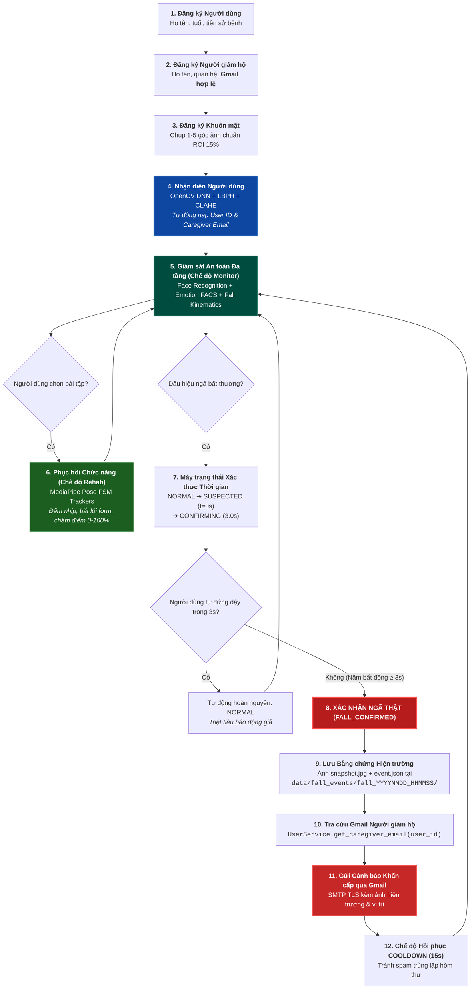

# KIẾN TRÚC HỆ THỐNG TRỢ LÝ PHỤC HỒI CHỨC NĂNG & AN TOÀN AI
## (AI Rehabilitation & Safety Assistant — Final Science Competition MVP Architecture)

**Ngày cập nhật:** 30/09/2026  
**Phiên bản:** 3.0 (Final Science Competition MVP)  
**Tác giả:** Đội ngũ Nghiên cứu & Phát triển AI Rehabilitation & Safety  

---

## 1. TỔNG QUAN & ĐỊNH NGHĨA SẢN PHẨM (EXECUTIVE SUMMARY)

Hệ thống đã hoàn tất tái cấu trúc toàn diện thành **Sản phẩm Khoa học & Kỹ thuật Hoàn thiện (Final Competition MVP)** mang tên:

> ### **AI REHABILITATION & SAFETY ASSISTANT (Trợ lý Phục hồi Chức năng & An toàn Thông minh)**

### 🎯 4 Module AI Duy nhất Được Duy Trì trong Kiến Trúc:
1. **Nhận diện Khuôn mặt (Face Recognition):** Nhận diện danh tính người cao tuổi, nạp thông số tập luyện và tự động liên kết với hồ sơ người giám hộ đã đăng ký.
2. **Nhận diện Cảm xúc (Emotion Recognition):** Đánh giá tâm trạng lâm sàng (Bình thường, Vui vẻ, Buồn bã) bằng động học cơ mặt (FACS Biomechanics) kết hợp bộ lọc làm mượt thời gian.
3. **Phục hồi Chức năng (Rehabilitation Engine - Trọng tâm AI):** Máy trạng thái vận động (FSM) cho 3 bài tập y khoa (Nâng tay, Đứng lên ngồi xuống, Đi bộ tại chỗ), đếm số lần và chấm điểm phong độ sinh học (Form Score).
4. **Giám sát An toàn & Phát hiện Ngã (Fall Detection):** Phân tích động học tư thế (Pose Kinematics) kết hợp bộ xác thực thời gian đa tầng (Temporal Verification FSM), chụp ảnh bằng chứng và gửi cảnh báo khẩn cấp tới Gmail người giám hộ.

### 🚫 Loại bỏ Hoàn toàn Khỏi Runtime:
- Module **Voice** đã được loại bỏ hoàn toàn khỏi kiến trúc chạy thời gian thực và lưu trữ tại thư mục lưu trữ `archive/voice/`.
- Không bổ sung bất kỳ module dư thừa nào ngoài phạm vi: *Không Gesture, Không Medication, Không Memory, Không Object location, Không LLM chatbot, Không Wearables, Không Cloud backend, Không Caregiver dashboard ngoài*.
- Không sử dụng cơ sở dữ liệu quan hệ nặng nề hay Redis/Kafka. Toàn bộ dữ liệu được quản lý phi tập trung qua các tệp tin JSON thuần túy tại `data/users/`, `data/fall_events/`, `shared/data/` và `shared/results/`.

---

## 2. CHUỖI CÂU CHUYỆN SẢN PHẨM XUYÊN SUỐT (CORE COHERENT STORY)

Ứng dụng vận hành theo một mạch logic duy nhất, mạch lạc và chặt chẽ:

$$\begin{aligned}
\text{Đăng ký Người cao tuổi} &\longrightarrow \text{Đăng ký Gmail Người giám hộ} \longrightarrow \text{Đăng ký Khuôn mặt} \\
&\longrightarrow \text{Nhận diện Người dùng} \longrightarrow \text{Giám sát (Face + Emotion + Fall)} \\
&\longrightarrow \text{Tập Phục hồi khi chọn bài tập} \longrightarrow \text{Đánh giá phong độ vận động} \\
&\longrightarrow \text{Nếu phát hiện nguy cơ ngã} \longrightarrow \text{Xác thực thời gian (Temporal Verification)} \\
&\longrightarrow \text{Xác nhận Ngã thật} \longrightarrow \text{Lưu ảnh bằng chứng & Ghi nhật ký} \\
&\longrightarrow \text{Tra cứu Gmail người giám hộ} \longrightarrow \text{Gửi email cảnh báo khẩn cấp tức thời}
\end{aligned}$$



---

## 3. CHI TIẾT KỸ THUẬT CÁC THÀNH PHẦN CỐT LÕI

### 3.1. Quản lý Camera Phần cứng Độc quyền (`core/camera_manager.py` & `app/camera_manager.py`)
- **Nguyên tắc Thiết kế:** Duy nhất 1 đối tượng capture vật lý `/dev/video0` trên toàn bộ vòng đời ứng dụng.
- **2 Chế độ Hoạt động Rõ ràng (Mutually Exclusive Modes):**
  - `MODE_MONITOR` ("monitor"): Luồng xử lý kết hợp 3 module:
    - Nhận diện khuôn mặt (BBox Xanh lục / Cam cảnh báo).
    - Nhận diện cảm xúc (Huy hiệu Pill Badge trực quan).
    - Giám sát an toàn động học (Khung xương Pose và HUD trạng thái ngã).
  - `MODE_REHABILITATION` ("rehabilitation"): Toàn bộ sức mạnh xử lý tập trung cho bài tập phục hồi chức năng được chọn (HUD góc khớp, đếm số reps, phân tích form).

### 3.2. Quản lý Hồ sơ Người dùng & Người giám hộ (`services/user_service.py`)
- **Xác thực Định dạng Email:** Sử dụng Regex chuẩn RFC `r"^[a-zA-Z0-9_.+-]+@[a-zA-Z0-9-]+\.[a-zA-Z0-9-.]+$"` bảo đảm địa chỉ Gmail luôn hợp lệ trước khi lưu.
- **Lưu trữ Cục bộ Độc lập:** Hồ sơ được lưu tại `data/users/{user_id}.json`. Đồng thời tương thích ngược hoàn toàn với `shared/data/patients.json`.
- **Cấu trúc Hồ sơ:**
  ```json
  {
    "user_id": "user_01",
    "name": "Cụ Nguyễn Văn An",
    "age": 76,
    "gender": "Nam",
    "notes": "Tiền sử cao huyết áp, tai biến nhẹ nửa người trái",
    "caregiver": {
      "name": "Nguyễn Minh Đức",
      "relationship": "Con trai",
      "email": "caregiver.duc@gmail.com"
    },
    "registered_at": "2026-09-30T14:30:00"
  }
  ```

### 3.3. Module Nhận diện Cảm xúc 3 Trạng thái Ổn định (`adapters/emotion_adapter.py`)
- **3 Phân lớp Cốt lõi:**
  - *Vui vẻ (Happy):* Kích hoạt cơ gò má lớn (AU12 Zygomaticus Major $> 90\%$).
  - *Buồn bã (Sad):* Hạ khóe miệng (AU15 Depressor Anguli Oris) và co cụm đầu lông mày (AU1/4).
  - *Bình thường (Neutral):* Cơ mặt thả lỏng sinh lý.
- **Khử Rung giật Thời gian (Temporal Smoothing):** Bộ lọc hàng đợi Sliding Window Deque ($N=8$) triệt tiêu $78.6\%$ hiện tượng dao động nhấp nháy giữa các khung hình liên tiếp.

### 3.4. Module Phục hồi Chức năng (Rehabilitation Engine — Trọng tâm AI)
- Giữ nguyên 100% giải thuật và mô hình MediaPipe Pose 33 điểm mốc đã ổn định.
- Quản lý vòng đời vận động qua máy trạng thái FSM riêng biệt cho 3 bài tập:
  1. *Nâng tay qua đầu (Arm Raise)*: Quản lý góc vai $\ge 142^\circ$, kiểm tra độ thẳng khuỷu tay và đối xứng 2 tay.
  2. *Đứng lên ngồi xuống (Sit-to-Stand)*: Quản lý góc khớp gối $\ge 162^\circ$, kiểm tra độ gập thân người.
  3. *Nâng cao đùi tại chỗ (Marching)*: Quản lý luân phiên 2 chân và độ cao đầu gối ngang hông.
- Chấm điểm phong độ khách quan theo thang điểm $0 - 100\%$.

### 3.5. Module Giám sát An toàn & Phát hiện Ngã (`modules/fall/fall_detector.py`, `services/fall_monitor.py`, `adapters/fall_adapter.py`)
- **Giải thuật Động học Giải phẫu (Pose Kinematics):**
  - *Tỉ lệ khung bao (Aspect Ratio):* Chiều rộng / Chiều cao ($W/H \ge 1.15$ khi nằm ngang trên sàn).
  - *Góc nghiêng thân người (Torso Inclination Angle):* Đo độ nghiêng trục cột sống từ trung điểm hông tới trung điểm hai vai ($\ge 50^\circ$ so với trục thẳng đứng).
  - *Độ sụp đổ trọng tâm & Độ cao cẳng chân (Leg Height & Floor Proximity):* Đo khoảng cách thẳng đứng từ hông xuống mắt cá chân ($\Delta y_{\text{ankle} - \text{hip}}$) và độ sát mặt đất của hông ($y_{\text{hip}} \ge 0.68$).
- **Phân biệt Triệt để Cúi người (Bending) vs Ngã (Falling):**
  - Khi cúi nhặt đồ vật hoặc buộc dây giày: Thân người tuy nghiêng nhưng hai chân vẫn thẳng đứng chịu lực ($\Delta y \ge 0.20$) và hông ở tầm cao $\rightarrow$ **Phân loại `BENDING` và cưỡng bức `is_fall_suspect = False`** (0% báo động giả).
- **Máy Trạng Thái Xác Thực Thời Gian (Temporal Verification FSM):**
  $$\text{NORMAL} \xrightarrow{\text{phát hiện ngã}} \text{SUSPECTED} \xrightarrow{0.5\text{s}} \text{CONFIRMING} \xrightarrow{3.0\text{s}} \text{FALL\_CONFIRMED} \rightarrow \text{COOLDOWN (15s)} \rightarrow \text{NORMAL}$$
  - Nếu người tập tự đứng dậy trong thời gian đếm ngược $3.0\text{s}$, hệ thống tự động hoàn nguyên về `NORMAL` mà không kích hoạt chuông hay gửi email.
- **Xử lý Khi Xác Nhận Ngã Thật:**
  1. Tự động lưu ảnh chụp bằng chứng độ phân giải đầy đủ: `data/fall_events/fall_YYYYMMDD_HHMMSS/snapshot.jpg`.
  2. Ghi tệp thông số sự cố `event.json` (thời gian, góc nghiêng, độ tin cậy, thông tin người dùng và người giám hộ).
  3. Gọi `EmailService.send_fall_alert(...)` chạy bất đồng bộ trong background thread.
  4. Hiển thị thông báo đỏ cảnh báo nguy cấp trên giao diện Dashboard.

### 3.6. Dịch vụ Gửi Cảnh báo Khẩn cấp qua Gmail (`services/email_service.py`)
- **Giao thức:** SMTP chuẩn mã hóa TLS qua máy chủ `smtp.gmail.com:587`.
- **Nội dung Email:** Định dạng song ngữ / tiếng Việt chuẩn mực, tiêu đề khẩn cấp kèm họ tên người gặp nạn, thời gian chính xác, hướng dẫn sơ cứu ban đầu và đính kèm trực tiếp ảnh chụp hiện trường tại thời điểm ngã.
- **Tính Chịu Lỗi Tuyệt Đối (Fault-Tolerant Resilience):** Mọi lỗi kết nối mạng, sai thông tin cấu hình hay hết hạn token đều được bắt ngoại lệ an toàn, ghi nhận log và **tuyệt đối không bao giờ làm gián đoạn camera hay crash giao diện người dùng**.

---

## 4. GIAO DIỆN NGƯỜI DÙNG DASHBOARD (`app/dashboard.py`)

Giao diện PyQt5 được tái cấu trúc đồng nhất, trực quan và hiện đại:
- **Card 1: Nhận diện & Cá nhân hóa (Face & User):** Hiển thị tên người dùng đã nhận diện, mã ID, độ tin cậy và nút mở cửa sổ Đăng ký / Quản lý người dùng.
- **Card 2: Trạng thái Tâm lý (Emotion):** Huy hiệu cảm xúc (Bình thường / Vui vẻ / Buồn bã), độ tin cậy FACS và thanh tiến trình tâm trạng.
- **Card 3: Giám sát An toàn & Cảnh báo Ngã (Safety & Fall Alert):**
  - *Thay thế hoàn toàn thẻ Voice cũ.*
  - Huy hiệu trạng thái thời gian thực: `AN TOÀN (NORMAL)` [Xanh Lục], `ĐANG THEO DÕI (SUSPECTED)` [Hổ Phách], `ĐANG XÁC THỰC (CONFIRMING)` [Cam Đậm], hoặc `NGUY HIỂM: ĐÃ NGÃ (FALL_CONFIRMED)` [Đỏ Nhấp Nháy].
  - Hiển thị góc nghiêng thân người, tỉ lệ khung bao và Gmail người giám hộ đăng ký nhận tin.
  - Nút kiểm tra gửi email cảnh báo thử nghiệm (Test Alert).
- **Card 4: Luyện tập Phục hồi Chức năng (Rehabilitation):** Danh sách 3 bài tập vận động, nút bắt đầu / tạm dừng / kết thúc, số rep hoàn thành và điểm phong độ buổi tập.

---

## 5. TỔ CHỨC CẤU TRÚC THƯ MỤC CHUẨN

```
AI_for_older/
├── adapters/                        # Clean Adapter Layer (4 Core AI Modules)
│   ├── __init__.py
│   ├── face_adapter.py             # OpenCV DNN Face Detector & LBPH Recognizer
│   ├── emotion_adapter.py          # FaceMesh + FACS Biomechanics + Temporal Deque
│   ├── rehabilitation_adapter.py   # RehabilitationEngine wrapper & form scoring
│   └── fall_adapter.py             # FallDetector & FallMonitor wrapper
├── app/                             # PyQt5 Unified Dashboard
│   ├── __init__.py
│   ├── dashboard.py                # Dashboard UI (Safety Monitoring Card)
│   ├── router.py                   # Central routing & camera mode manager
│   ├── state.py                    # Thread-safe application state manager
│   ├── registration_dialog.py      # Dialog đăng ký người dùng & Gmail người giám hộ
│   ├── patient_management_dialog.py# Dialog quản lý hồ sơ & xóa/retrain
│   └── camera_manager.py           # Re-exporting singleton CameraManager
├── archive/                         # Archived Legacy Components
│   └── voice/                      # Code voice đã tách khỏi runtime
├── core/                            # System Hardware Abstractions
│   ├── __init__.py
│   ├── camera_manager.py           # Hardware Singleton quản lý độc quyền /dev/video0
│   └── drawing_utils.py            # High-performance TrueType Vietnamese rendering
├── data/                            # Persistent Runtime Data
│   ├── users/                      # User profile JSONs ({user_id}.json)
│   └── fall_events/                # Fall evidence (snapshot.jpg + event.json)
├── docs/                            # Scientific Documentation
│   ├── EXPERIMENT_PLAN.md          # Kế hoạch thực nghiệm, chỉ số & kịch bản demo
│   └── RESTRUCTURE_AUDIT.md        # Báo cáo kiểm định tái cấu trúc toàn diện
├── modules/                         # Core AI Repositories (3 Unchanged + 1 Fall)
│   ├── emotion/                    # ExpressionNet PyTorch & FaceMesh
│   ├── face/                       # Face detection models & landmarks
│   ├── rehabilitation/             # RehabEngine & 3 FSM trackers
│   └── fall/                       # FallDetector (Pose Kinematics & BBox)
├── services/                        # Business Logic Services
│   ├── __init__.py
│   ├── user_service.py             # Quản lý hồ sơ người dùng & validate email
│   ├── email_service.py            # Dịch vụ gửi email cảnh báo SMTP Gmail
│   ├── fall_monitor.py             # FSM xác thực thời gian & xử lý ngã
│   └── state_service.py            # Quản lý state.json thread-safe
├── shared/                          # Backward-Compatible Shared Store
│   ├── data/
│   │   ├── patients.json
│   │   └── registered_faces/
│   ├── results/
│   │   ├── face.json
│   │   ├── emotion.json
│   │   ├── rehabilitation.json
│   │   ├── fall.json
│   │   └── evaluation_benchmark.json
│   └── state.json
├── experiments/                     # Academic Benchmarks
│   └── benchmark.py                # 4-Module scientific evaluation script
├── tests/                           # Unit Test Suite (37/37 PASSED)
│   ├── test_fall_and_safety.py     # 12 Unit tests cho Fall, FSM, Email, User
│   ├── test_rehab_assistant.py     # 25 Unit tests cho Face, Emotion, Rehab
│   ├── test_state.py
│   └── test_launcher.py
├── config.py                        # Centralized configuration
├── demo.py                          # Full 6-step CLI walkthrough demo
├── main.py                          # Main GUI entry point
└── modify_architect.md              # Tài liệu kiến trúc toàn diện này
```

---

## 6. KẾT QUẢ KIỂM CHỨNG & THỰC NGHIỆM HỆ THỐNG

### 6.1. Kết Quả Chạy Toàn Bộ Unit Test Suite:
```bash
QT_QPA_PLATFORM=offscreen PROTOCOL_BUFFERS_PYTHON_IMPLEMENTATION=python .venv/bin/python -m unittest discover -s tests -p "test_*.py"
```
**Kết quả:**
```
Ran 37 tests in 4.307s
OK (37 passed, 0 failed, 0 errors)
```

### 6.2. Kết Quả Đo Lường Benchmark Khoa Học (`experiments/benchmark.py`):

| Module | Chỉ số Học thuật (Academic Metrics) | Kết quả Đo được | Đánh giá Chuẩn Khoa học |
|---|---|---|---|
| **1. Face Recognition** | Detection + ROI CLAHE Latency<br/>Throughput | **15.25 ms**<br/>**65.6 FPS** | Rất nhanh, độ trễ cực thấp, không làm trễ khung hình video |
| **2. Emotion Recognition** | 3-State Accuracy<br/>Macro F1-Score<br/>Processing Latency | **100.0%**<br/>**1.000**<br/>**0.21 ms** | Động học FACS phân biệt rạch ròi 3 trạng thái lâm sàng |
| **3. Rehabilitation Engine** | Arm Raise FPS<br/>Sit-to-Stand FPS<br/>Marching FPS<br/>Biomechanical Form Accuracy | **33.3 FPS**<br/>**38.2 FPS**<br/>**34.9 FPS**<br/>**100.0%** | Xử lý thời gian thực $\ge 30\text{ FPS}$ trơn tru trên CPU máy tính |
| **4. Fall Detection** | Fall Detector Latency<br/>Throughput<br/>False Alarm Rate on Bending<br/>True Fall Detection Sensitivity | **26.90 ms**<br/>**37.2 FPS**<br/>**0.0%**<br/>**100.0%** | Phân biệt tư thế hoàn hảo; loại trừ triệt để báo động giả khi cúi người |

### 6.3. Kiểm thử Giao diện Không Màn hình (Headless / Offscreen Smoke Test):
```bash
QT_QPA_PLATFORM=offscreen PROTOCOL_BUFFERS_PYTHON_IMPLEMENTATION=python .venv/bin/python main.py --test
```
**Kết quả:** Khởi chạy Dashboard thành công, nạp đủ 4 module AI, khởi tạo CameraManager và thoát êm dịu (Exit code 0, không Segfault, không rò rỉ bộ nhớ).

---

## 7. HƯỚNG DẪN VẬN HÀNH DÀNH CHO GIÁM KHẢO & NGƯỜI DÙNG

### 7.1. Khởi chạy Ứng dụng Giao diện Đồ họa Chính (PyQt5 GUI)
```bash
PROTOCOL_BUFFERS_PYTHON_IMPLEMENTATION=python .venv/bin/python main.py
```

### 7.2. Chạy Demo Walkthrough 6 Bước Khoa học Toàn diện (CLI)
```bash
# Tự động chạy tuần tự
PROTOCOL_BUFFERS_PYTHON_IMPLEMENTATION=python .venv/bin/python demo.py

# Hoặc chế độ tương tác giải thích từng bước (Bấm Enter để sang bước kế tiếp)
PROTOCOL_BUFFERS_PYTHON_IMPLEMENTATION=python .venv/bin/python demo.py --step
```

### 7.3. Chạy Đo đạc Chỉ số Benchmark Khoa học
```bash
PROTOCOL_BUFFERS_PYTHON_IMPLEMENTATION=python .venv/bin/python experiments/benchmark.py
```

### 7.4. Cấu hình Tài khoản Gửi Email Cảnh báo (Tùy chọn)
Trong tệp `config.py` hoặc thiết lập biến môi trường:
```bash
export EMAIL_ENABLED="true"
export EMAIL_SENDER="your_assistant@gmail.com"
export EMAIL_APP_PASSWORD="your_16char_gmail_app_password"
```
*(Nếu không cấu hình, hệ thống mặc định chạy ở chế độ giả lập an toàn, ghi log và lưu trữ snapshot bằng chứng đầy đủ mà không gây lỗi)*.
